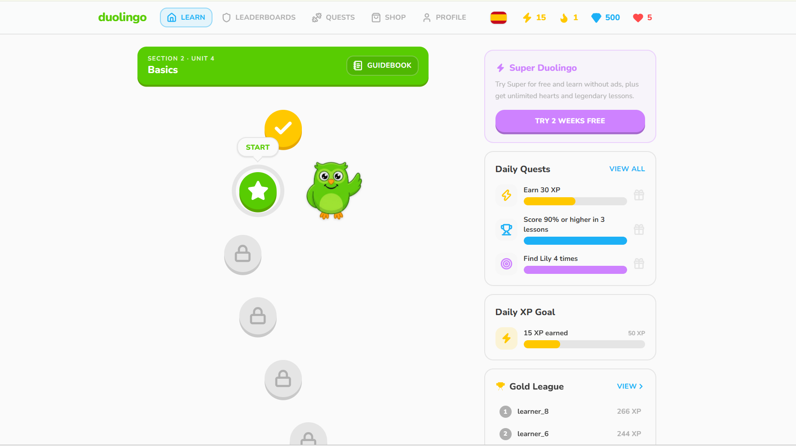
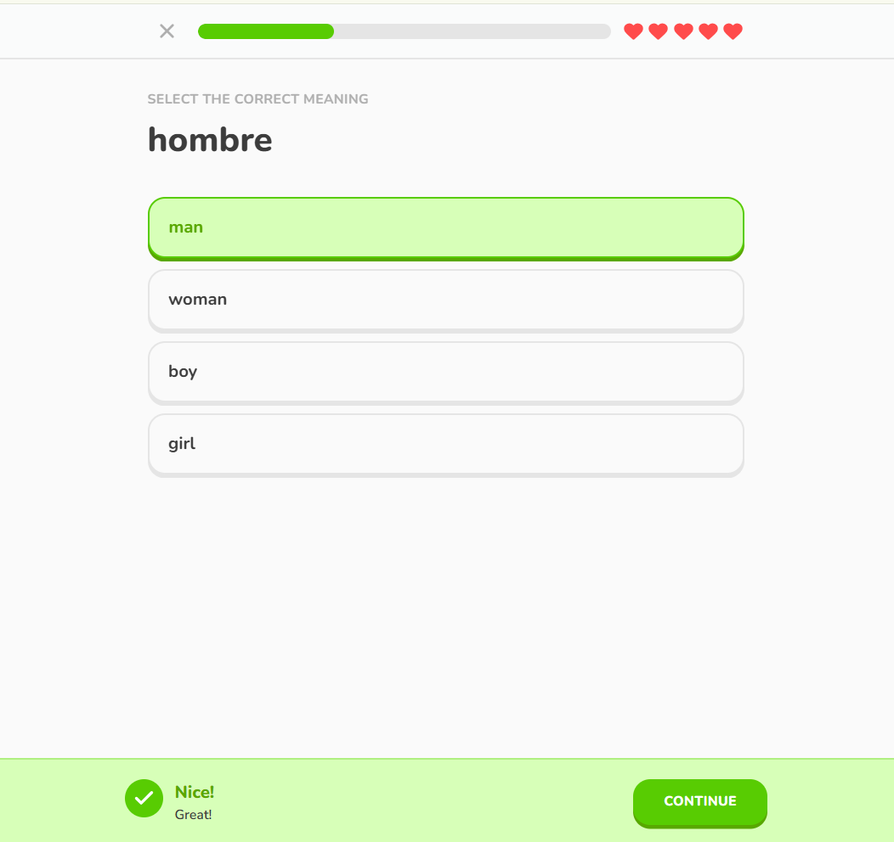
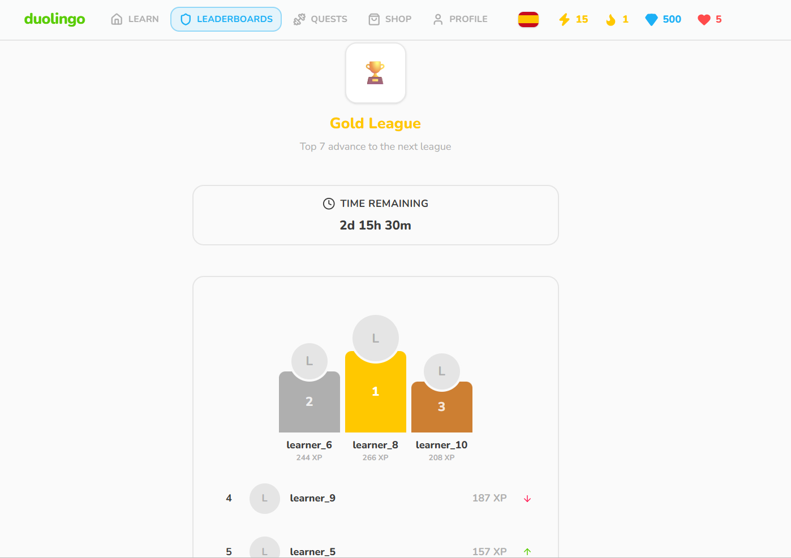
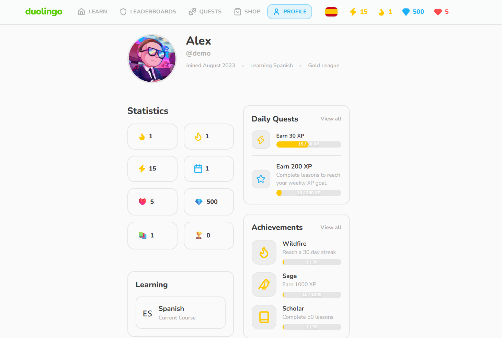
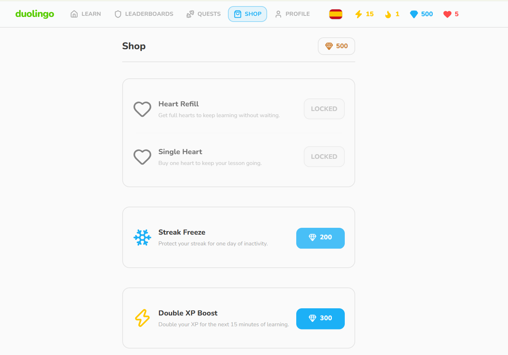
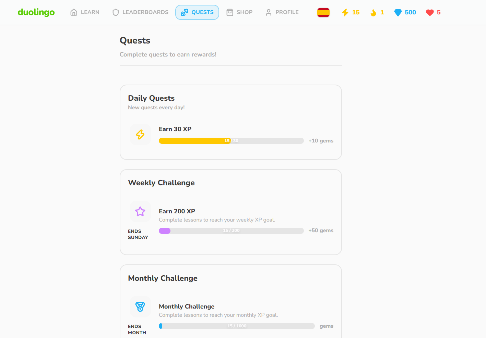

# 🦉 Duolingo Clone – Full Stack Learning Platform

A full-stack clone of the Duolingo web application built as part of the Scaler AI Labs SDE Full Stack Assignment.

The project recreates the core Duolingo learning experience with an interactive lesson engine, gamification mechanics, skill tree progression, profile system, quests, achievements, leaderboard, shop, and a FastAPI backend powered by SQLite.

---

## 🚀 Live Demo

**Frontend:** https://YOUR-VERCEL-LINK.vercel.app

**Backend API:** https://YOUR-RENDER-LINK.onrender.com

**API Documentation (Swagger):**

https://YOUR-RENDER-LINK.onrender.com/docs

---

# ✨ Features

## 📚 Learning Experience

- Interactive Duolingo-style learning path
- Skill tree with progression
- Locked & unlocked lessons
- Multiple exercise types
- Progress tracking
- Lesson completion rewards

### Supported Exercise Types

- Multiple Choice
- Word Bank
- Match Pairs
- Fill in the Blank
- Type the Answer
- Translate

---

## 🎮 Gamification

- XP System
- Daily Streak
- Hearts System
- Gems Economy
- Daily Quests
- Achievements
- Activity Feed
- Shop System
- Double XP Boost
- Leaderboard

---

## 👤 User Features

- User Profile
- Statistics Dashboard
- Recent Activity
- Progress Tracking
- Achievement Progress
- Quest Progress

---

## 🛍 Shop

- Heart Refill
- Single Heart
- Double XP Boost
- Streak Freeze

---

## 🏆 Leaderboard

- Live leaderboard
- XP ranking
- League visualization

---

# 🏗 Tech Stack

## Frontend

- Next.js (App Router)
- React
- TypeScript
- Tailwind CSS
- ShadCN UI
- Framer Motion

## Backend

- FastAPI
- SQLAlchemy 2.0
- Pydantic v2
- Alembic

## Database

- SQLite

## Development Tools

- Git & GitHub
- Vercel
- Render
- Swagger / OpenAPI

---

# 📁 Project Structure

```text
Duolingo-Clone/
│
├── frontend/
│   ├── app/
│   ├── components/
│   ├── hooks/
│   ├── providers/
│   ├── services/
│   └── ...
│
├── backend/
│   ├── app/
│   │   ├── models/
│   │   ├── schemas/
│   │   ├── routers/
│   │   ├── repositories/
│   │   ├── services/
│   │   ├── db/
│   │   ├── seed/
│   │   └── ...
│   │
│   ├── alembic/
│   └── duolingo.db
│
└── README.md
```

---

# 🏛 Architecture

```
                Next.js Frontend
                        │
                 REST API Calls
                        │
                 FastAPI Backend
                        │
                  Service Layer
                        │
               Repository Layer
                        │
             SQLAlchemy ORM
                        │
                 SQLite Database
```

---

# 🗄 Database Schema

The backend uses a relational SQLite database designed using SQLAlchemy.

Main entities:

- Users
- User Progress
- Courses
- Units
- Skills
- Lessons
- Exercises
- Quests
- User Quests
- Achievements
- User Achievements
- Shop Items
- Inventory
- Activities

Relationships are implemented using SQLAlchemy ORM with proper foreign keys and constraints.

---

# 🌐 REST API

## Users

```
GET /api/v1/users/demo
```

## Courses

```
GET /api/v1/courses
GET /api/v1/courses/{id}
```

## Lessons

```
GET /api/v1/lessons
GET /api/v1/lessons/{id}
```

## Leaderboard

```
GET /api/v1/leaderboard
```

## Shop

```
GET /api/v1/shop
```

## Quests

```
GET /api/v1/quests
```

## Achievements

```
GET /api/v1/achievements
```

## Activities

```
GET /api/v1/activities
```

Interactive API documentation is available through Swagger.

---

# ⚙ Local Setup

## Clone Repository

```bash
git clone https://github.com/YOUR_USERNAME/Duolingo-Clone.git

cd Duolingo-Clone
```

---

# Frontend Setup

```bash
cd frontend

npm install

npm run dev
```

Runs on:

```
http://localhost:3000
```

---

# Backend Setup

Create virtual environment

```bash
python -m venv venv
```

Activate

Windows

```bash
.\venv\Scripts\activate
```

Install dependencies

```bash
pip install -r requirements.txt
```

Run migrations

```bash
alembic upgrade head
```

Seed database

```bash
python -m app.seed.seed_database
```

Run server

```bash
python -m uvicorn app.main:app --reload
```

Backend runs on

```
http://localhost:8000
```

Swagger Docs

```
http://localhost:8000/docs
```

---

# 📸 Screenshots

## 🏠 Home Page



---

## 📚 Lesson Player



---

## 🏆 Leaderboard



---

## 👤 Profile



---

## 🛍️ Shop



---

## 🎯 Quests



---


# Assumptions

- A seeded demo user is provided.
- One language course (Spanish) is included.
- Course content is seeded in SQLite.
- Authentication is simplified for demonstration.
- Gameplay state (XP, Hearts, Streak, etc.) is managed through the frontend state while read-only content is fetched from the FastAPI backend.

---

# Future Improvements

- Firebase / Supabase Authentication
- Cloud Progress Synchronization
- Audio Pronunciation
- Speech Recognition
- Multiplayer Challenges
- Notifications
- Mobile PWA Support

---

# Original Work

This project was developed independently as part of the Scaler AI Labs Software Engineering Internship Assignment.

All code, architecture, UI integration, backend implementation, and database design were created specifically for this submission.

## Live Demo

Frontend: https://duolingo-clone-zeta-eight.vercel.app/

Backend API: https://duolingo-clone-ob9w.onrender.com

API Docs: https://duolingo-clone-ob9w.onrender.com/docs
